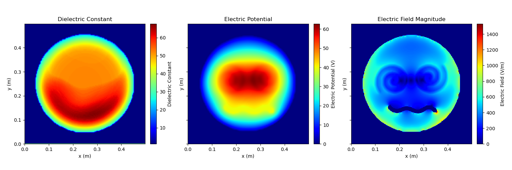

# 2D-Electrostatic-FDM
A minimalistic Python framework for solving 2D electrostatic problems using the Finite Difference Method (FDM), where users can easily provide problem specifications through bitmaps. This repository provides a basic, easy-to-understand implementation ideal for educational purposes, and it is primarily based on the concepts presented [here](https://ieeexplore.ieee.org/document/6931698).

## Usage
Refer to `example.py` for a self-explanatory demonstration of the framework's application.
